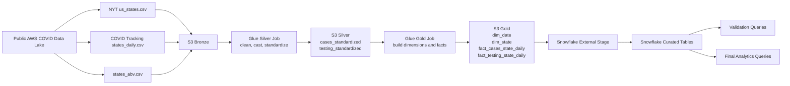

# COVID-19 Analytics Pipeline with AWS Glue, PySpark, S3, and Snowflake

## Overview

This project implements an end-to-end COVID-19 analytics pipeline using public AWS COVID-19 datasets. The pipeline ingests raw files into Amazon S3, standardizes them with AWS Glue and PySpark, builds a Gold star schema, and loads the final analytical tables into Snowflake for reporting and query analysis.

The original project design was AWS-focused and expected Redshift as the serving warehouse. In this implementation, Snowflake is used instead of Redshift while preserving the same Bronze → Silver → Gold architecture and the same final analytical model.

## Project Objective

The goal of this project is to build a cloud-based analytics pipeline that transforms public COVID-19 data into a warehouse-ready model for state-level daily analysis.

The final warehouse supports:

- cumulative cases and deaths by state
- daily new cases and new deaths by state
- cumulative testing metrics by state
- daily new tests by state
- positivity rate analysis
- trend reporting across dates and states

## Data Sources

This project uses public AWS Open Data COVID-19 datasets.

### Bronze datasets used

- `nytimes/us_states.csv` for state-level cases and deaths
- `covid_tracking/states_daily.csv` for state-level testing metrics
- `static/states_abv.csv` for state code and state name mapping

## Architecture

The project follows a layered medallion-style pipeline:

### Bronze
Raw source files copied into Amazon S3.

### Silver
Standardized Parquet outputs created using AWS Glue and PySpark.

### Gold
Analytics-ready dimensional and fact datasets written back to Amazon S3.

### Serving Layer
Snowflake tables loaded from Gold Parquet files using an external stage and `COPY INTO`.

## Final Data Model

### Dimensions

- `dim_date`
- `dim_state`

### Facts

- `fact_cases_state_daily`
- `fact_testing_state_daily`

## Tech Stack

- Amazon S3
- AWS Glue
- PySpark
- Snowflake
- SQL
  
## Workflow Diagram



## Repository Structure

```text
covid-19-analytics-snowflake/
│
├── README.md
├── .gitignore
├── docs/
│   ├── architecture.md
│   ├── setup-guide.md
│   ├── pipeline-flow.md
│   └── validation-and-testing.md
│
├── scripts/
│   ├── covid_silver_glue_job.py
│   └── covid_gold_glue_job.py
│
├── sql/
│   └── snowflake_setup_and_load.sql
│
├── screenshots/
│   ├── s3-bronze-files.png
│   ├── s3-silver-folders.png
│   ├── s3-gold-folders.png
│   ├── glue-silver-success.png
│   ├── glue-gold-success.png
│   ├── snowflake-tables-loaded.png
│   └── final-query-results.png
```
